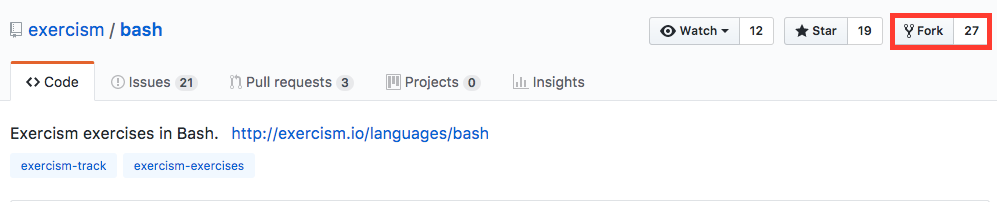
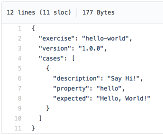

# Contributing to the Bash Track

There are a lot of great resources for contributing to Exercism in general
already.  Check out the [docs] repository for a larger overview and some more
general purpose instructions.

[docs]: (https://github.com/exercism/docs)

Make sure you read the [policies document] and follow the conventions we agreed upon.

[policies document]: (https://github.com/exercism/bash/blob/master/docs/POLICIES.md)

A great way to get started contributing is [porting an exercise] from another
track!  It helps you get into the repository, learn your way around, and see
how things are structured.

[porting an exercise]: (#porting-an-exercise-from-another-language)

## Getting Set Up

In order to run any of the test files (or examples, for that matter), you're
going to need Bash.  If you're on OSX or Linux, this shouldn't be a problem for
you.  Additionally, you'll need the Bash test runner that we're using: `bats`.
This can be installed via your package manager.  For more specifics, see the
[tests page] of this repositorys docs.

[tests page]: https://github.com/exercism/bash/blob/master/docs/TESTS.md

## Porting an Exercise from Another Language

Porting an exercise from another language is easy (ish)! [Problem
specifications] for [unimplemented exercises] can be used to do this.

[Problem specifications]: www.github.com/exercism/problem-specifications
[unimplemented exercises]: www.exercism.io/languages/bash/todo

The `_template` directory found in `exercism/bash` can be used to port
exercises. Once an example submission, full test suite and README.md have been
created, you just need to alter `config.json` to include the newly implemented
exercise.

### Initial Setup

Fork the Bash repository on GitHub (which you are currently in).



Clone the repository to your computer.

```bash
$ git clone https://github.com/<your-user-name>/bash.git
$ cd bash
```

Look through the [list of exercises not yet implemented] in Bash.  Once you've
found one you like, make sure that someone's not already working on it by
checking the [current open pull requests].  Also double check that the exercise
isn't in the list of exercises already implemented in your freshly cloned
repository: `path/to/bash/exercises`.  Once you've selected an exercise you
like, locate its *slug* (unique name) in the [master list] of problem
specifications.

[list of exercises not yet implemented]: http://exercism.io/languages/bash/todo
[current open pull requests]: https://github.com/exercism/bash/pulls
[master list]: https://github.com/exercism/problem-specifications/tree/master/exercises

Create a directory in your local `exercises` folder with that same slug name.

```bash
# Optionally, but probably a good idea, create a new branch for your exercise
$ git checkout -b <your-slug-here>
# Create the new exercise directory
$ mkdir exercises/<your-slug-here>
```

At the very least, you're going to need to create a `README.md`, a test file
(`your_exercise_test.sh`), and an example file which, by convention, you should
name `example.sh` when you're done.  For ease of debugging, you can start by
naming your file `your_exercise.sh`.

```bash
$ touch README.md
$ touch <your-exercise>_test.sh
$ touch <your-exercise>.sh
```

Ensure that both of the shell script files are executeable.

```bash
$ chmod a+x <your-exercise>_test.sh <your-exercise>.sh
```

Many, if not all, of the current exercises have *canonical data* about them
that is the same accross all languages.  This makes it so you don't have to
come up with test cases or informative intro material yourself.  You're
welcome!  Head over to your specific exercise page in the [master list] (same
link as above).  Specifically right now, you're interested in
`canonical_data.json`.



Currently, you're interested in all of the `"cases"`.  Each of these is a test
case that you'll have to implement in the specific vernacular of our
test-runner, `bats`.  Check out this repository's [test documentation] if you
missed the [Getting Set Up] section above.

[test documentation]: https://github.com/exercism/bash/blob/master/docs/TESTS.md
[Getting Set Up]: #getting-set-up

### Generating the Tests

Implement each of the test cases (along with any comments or explanations you
think are necessary for people who aren't sure of themselves).  When in doubt,
check out the other, already implemented exercises for an example.  Here's an
example of implementing the test case shown above.

```bash
#!/usr/bin/env bats

@test 'Say Hi!' {
  run bash hello_world.sh

  [ "$status" -eq 0 ]
  [ "$output" = "Hello, World" ]
}

# ... The rest of your tests
```

For each test you create, you should use the `description` value for the test
case description.  The `property` value is generally used by other languages to
specify what the function to be run is called.  Use your best judgement and
check out how other exercises handle this.  If there's just one property, you
can just test the script as a whole.  If there's multiple properties, consider
testing those as either subcommands or flags (e.g. an exercise with an encode
and a decode property could be handled by `run bash cyper.sh encode <argument>`
or by `run bash cypher.sh -e <argument>`).  You're the one writing the tests,
so you decide.  You'll get feedback when you open your pull request anyways, so
don't stress too much about it.

For test cases that are expected to return `true` or `false` make sure you are
expecting an output value. It is better to return `"true"` or `true`, to the
console instead of just relying on the exit status in bash (0 for success,
1-255 for error). This will be consistent with the existing exercises and
prevent possible issues in the future.

You can check to see if your example script works by running `bats`.

```bash
$ bats hello_world_test.sh
```

### Implementing an Example Solution

If you've been following along so far, your tests should fail.  Go ahead and
implement your solution in the `<your-exercise>.sh` file.  Make sure your file
has `#!/usr/bin/env bash` ([shebang]) at the top.

[shebang]: https://en.wikipedia.org/wiki/Shebang_(Unix)

Keep running your test file against it until your tests all pass.  This process
should help ensure that both your tests *and* your example are ship shape!

Once your tests and example are complete, rename `<your-exercise>.sh` to
`example.sh` to match all the other exercises.

### Updating the Config

Exercism makes heavy use of configuration files to automate things.  Now that
you're done with your solution, you can add your problem to
`bash/config.json`.  Check out the [configuration description] in the Exercism
docs for more info on each item.

[configuration description]: https://github.com/exercism/docs/blob/master/language-tracks/configuration/exercises.md

```javascript
// config.json
{
  "exercises": [
    // ... All the other exercises
  	{
      "core": false, // True or false, you decide
      "unlocked_by": "leap", // If core is false, pick a core exercise that
      						 // unlocks this one.  Something similar, but easier
      "difficulty": 1, // 1 == easy, 10 == impossible, you decide
      "slug": "<your-exercise>",
      "topics": [
        "control_flow_conditionals",
        "mathematics" // These can come from the topics list, linked below
      ],
      "uuid": "9ac0b041-a7aa-4b0c-952a-d38d35e2cd65" // see below
	}
  ]
}
```

Possible topics that describe your exercise can come from the [topics master
list], but you're not limited to those.

[topics master list]: https://github.com/exercism/problem-specifications/blob/master/TOPICS.txt

In order to get the `uuid` and check your work, you'll need the configlet,
which is a handy tool created to automate some of the more monotonous tasks
involved with this.  See the [configlet documentation] for more info.  Make
sure you have the most current configlet by running:

[configlet documentation]: (https://github.com/exercism/configlet)

```bash
$ bin/fetch-configlet
```

Each exercise *for each language* needs a unique ID number — a `uuid`.  The
configlet can help you generate one.

```bash
$ bin/configlet uuid
```

Copy/paste the generated value into the `uuid` field of your exercise.  Once
you're done, it's time to check your work.  Run the configlet linter.

```bash
$ bin/configlet lint .
# If for some reason you're not inside the project directory, instead use
$ bin/configlet lint path/to/bash
```

Hopefully it says everything is OK!

### Creating the README

There are two ways to create the README: generate it via the configlet, or
manually create it.  This guide covers them both.

#### Using the Configlet

The configlet has a generate command that uses Go templating and pulls from the
repository's `config` directory as well as each exercise's `.meta` directory.
For example, any necessary `hints.md` should be put in `.meta` so configlet may
pull it in. Learn more in the [configlet docs].  You should just be able to run:

[configlet docs]: https://github.com/exercism/configlet

```bash
$ bin/configlet generate <your-exercise>
```

This should auto-generate a nice README in your exercise directory.  If it
gives you any issues, no worries!  You can always get it done by...

#### Doing It Manually

Use the `config/exercise_readme.go.tmpl` file as a guide.  The README should
look something like this:

```markdown
# <Your Exercise Title>

... Description copied from the master exercise repo (where you got your tests)

... Any additional hints that need provided

... Bash standard material, copied from `docs/EXERCISE_README_INSERT.md`

## Source

... Copy credits from the master exercise repo

## Submitting Incomplete Solutions

It's possible to submit an incomplete solution so you can see how others have
completed the exercise.
```

### Cleaning Up

If you've been practicing good version control throughout this process, you may
have several commits.  At this point, you're almost ready to submit your pull
request, but you should rebase against the most recent upstream master branch.

```bash
# Assuming you've already 'git added' and 'git commited'
# If you don't already have the exercism/bash as your upstream remote:
$ git remote add upstream https://github.com/exercism/bash.git
# To get the most recent upstream version
$ git fetch upstream
# Rebase onto the upstream
$ git rebase upstream/master
```

Now you're ready to sync up with Github and open your pull request!

```bash
$ git push --force-with-lease origin <your-branch-name>
```


Good luck, happy scripting, and thanks for your help!

